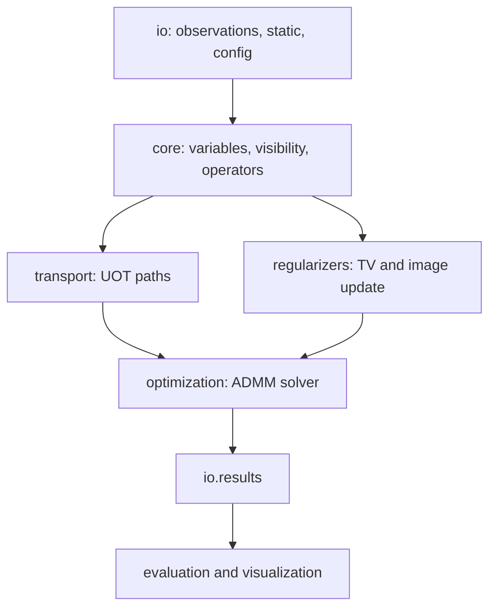

# Repository Verification Manifest

This manifest classifies each standalone module after Phase 5 verification.

## Classification Legend

- Reused: adapted directly from legacy conventions.
- Lightly modified: same responsibility as legacy code, with interface updates.
- Mathematically redesigned: changed to implement the formal ADMM/UOT
  specification.
- New support: repository infrastructure added for execution readiness.

## Module Manifest

| Module | Classification | Verification Status |
|---|---|---|
| `core.config` | New support | Imported, config validation tested, JSON round trip tested |
| `core.background` | Mathematically redesigned | Signed residual decomposition tested |
| `core.finite_differences` | Lightly modified | Gradient/divergence adjoint tested |
| `core.projections` | Mathematically redesigned | Exercised by image update tests |
| `core.variables` | Mathematically redesigned | Shape, nonnegativity, decomposition invariants tested |
| `core.visibility` | Lightly modified | Direct Fourier adjoint tested |
| `transport.continuity` | Mathematically redesigned | Continuity adjoint tested |
| `transport.kinetic_prox` | Mathematically redesigned | Kinetic prox special case tested |
| `transport.path_solver` | Mathematically redesigned | Constant path, identity path, source penalty tests |
| `transport.pairwise` | Mathematically redesigned | Shape/interface and ADMM integration tested |
| `transport.global_velocity` | Mathematically redesigned | Shape/interface and ADMM integration tested |
| `regularizers.tv` | Lightly modified | Exercised by image update and integration tests |
| `regularizers.image_residual_update` | Mathematically redesigned | Exact coupled subproblem exercised by ADMM tests |
| `optimization.admm_state` | New support | Imported and exercised by solver tests |
| `optimization.objective` | Mathematically redesigned | Objective/residual diagnostics tested |
| `optimization.convergence` | Mathematically redesigned | Exercised by solver history tests |
| `optimization.signed_residual_admm` | Mathematically redesigned | Pairwise/global integration and CLI smoke tested |
| `io.observations` | Reused conventions | Synthetic NPZ loading and global scaling tested |
| `io.static_init` | Reused conventions | PNG normalization and visibility calibration tested |
| `io.config_io` | New support | JSON round trip tested |
| `io.ground_truth` | Lightly modified | Imported by CLI and used for GT-compatible result files |
| `io.results` | Lightly modified | Standalone and legacy-compatible keys tested |
| `evaluation.metrics` | Lightly modified | Metric summary exercised in pipeline test |
| `visualization.outputs` | Lightly modified | Frame PNG and comparison strip output tested |
| `drivers.run_reconstruction` | Lightly modified | Pairwise and global CLI smoke tested |
| `tests.*` | New support | 18 tests passing |

## Bugs Corrected During Phase 5

1. Static PNG frames were loaded on a 0-255 scale by default. They now normalize
   to `[0,1]` unless explicitly disabled.
2. Observation NPZ files were normalized with per-frame visibility scales. The
   directory loader now uses a global visibility amplitude scale across selected
   frames, matching the legacy workflow.
3. Static reconstruction calibration was missing. The standalone loader now
   supports legacy-compatible `none`, `per_frame`, and `global` scalar
   calibration against complex visibilities.
4. Result files did not expose legacy-compatible keys. Saved NPZ files now
   include `joint`, `static`, `background_video`, and residual arrays when
   inputs are available.
5. The package lacked explicit config persistence. It now writes and reads
   JSON experiment configurations.

## Dependency Graph

